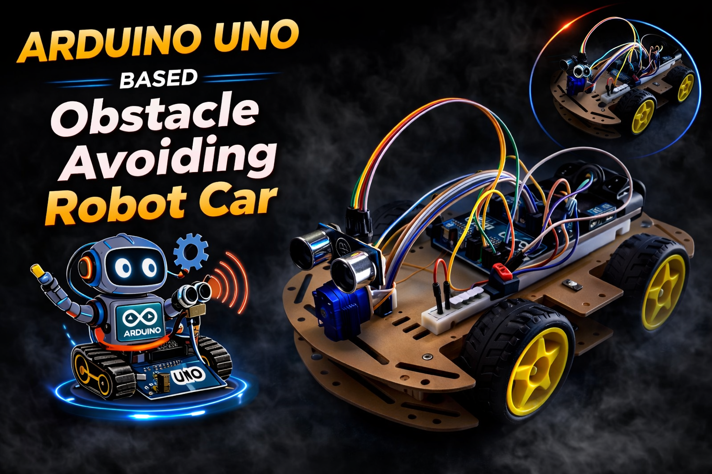

# 🤖 Arduino Obstacle Avoiding Robot Car

A 4WD autonomous robot car built with an Arduino Uno R3 that uses an ultrasonic sensor mounted on a servo motor to detect and avoid obstacles in real time.

---

## 📸 Project Overview

This robot continuously moves forward while scanning for obstacles. When an object is detected within a set distance, the car stops, backs up, looks left and right using a servo-mounted sensor, and then turns toward the clearer path — all without any human input.


---

## 🛒 Components Used

| Component | Specification | Quantity |
|:---|:---|:---:|
| Microcontroller | Arduino Uno R3 DIP | 1 |
| Motor Driver | L298N Dual H-Bridge | 1 |
| Chassis | 4WD Car Chassis | 1 |
| Gear Motors + Wheels | TT Gear Motors (4+4 set) | 4 |
| Servo Motor | SG90 (180°) | 1 |
| Ultrasonic Sensor | HC-SR04 | 1 |
| Battery Holder | 3-Cell 18650 Li-ion Holder | 1 |
| Li-ion Batteries | 18650 (≈3.7V each → ~11.1V total) | 3 |
| Toggle Switch | SPST or SPDT | 1 |
| Jumper Wires | Male-to-Male & Male-to-Female | Several |
| Sensor Bracket | Servo + HC-SR04 mount bracket | 1 |

> ⚠️ **Battery Note:** The label "18750 mAh" in the BOM refers to the **18650 cell form factor**. Standard 18650 cells are typically **2000–3500 mAh each**. Always verify your cell's real capacity before use.

---

## 🔌 Wiring & Connections

> ⚠️ **Safety First:** Always turn OFF your battery switch or disconnect the battery pack before making or changing any wiring connections.

---

### 1. Power Supply (3-Cell Li-ion Battery Pack → ~11.1V)

The battery pack powers both the L298N motor driver and the Arduino Uno.

| Battery Wire | Connect To |
|:---|:---|
| Positive (+) | `12V` terminal on L298N **AND** `VIN` pin on Arduino Uno |
| Negative (–) | `GND` terminal on L298N **AND** `GND` pin on Arduino Uno |

> 💡 Place your **toggle switch** in series on the positive (+) wire coming from the battery so you can safely cut power to the whole circuit.

---

### 2. Motors → L298N Motor Driver

Pair the left motors together and the right motors together so each side acts as a single unit.

| Motor Pair | L298N Output Terminals |
|:---|:---|
| Left Front + Left Rear Motors | `OUT1` and `OUT2` |
| Right Front + Right Rear Motors | `OUT3` and `OUT4` |

> 💡 If the wheels spin in the **wrong direction** after upload, simply **swap the two wires** in the corresponding OUT terminal — no code change needed.

---

### 3. L298N Motor Driver → Arduino Uno

> ⚠️ **Important:** Remove the black shorting jumpers on the **ENA** and **ENB** pins of the L298N. These jumpers lock the motors at full speed and prevent PWM speed control from working.

| L298N Pin | Arduino Uno Pin | Notes |
|:---|:---|:---|
| `ENA` | Pin `5` | PWM Speed Control — Left Motors |
| `IN1` | Pin `6` | Direction Control |
| `IN2` | Pin `7` | Direction Control |
| `IN3` | Pin `8` | Direction Control |
| `IN4` | Pin `9` | Direction Control |
| `ENB` | Pin `3` | PWM Speed Control — Right Motors |
| `GND` | `GND` | Common Ground |

---

### 4. HC-SR04 Ultrasonic Sensor → Arduino Uno

| HC-SR04 Pin | Arduino Uno Pin |
|:---|:---|
| `VCC` | `5V` |
| `Trig` | Pin `A0` |
| `Echo` | Pin `A1` |
| `GND` | `GND` |

---

### 5. SG90 Servo Motor → Arduino Uno

Mount the HC-SR04 sensor on top of the SG90 servo using a bracket. The servo rotates the sensor left and right to scan the environment.

| SG90 Wire Color | Arduino Uno Pin |
|:---|:---|
| Red | `5V` |
| Brown / Black | `GND` |
| Orange / Yellow (Signal) | Pin `11` |

> 💡 **Power Tip:** If your Arduino **randomly resets** when the servo moves, the servo is drawing too much current from the Arduino's 5V pin. To fix this, power the servo's Red wire from the **5V terminal on the L298N** instead (make sure the `5V-EN` jumper on the L298N is still in place). Keep only the signal wire and GND connected to the Arduino.

---

## 📐 Wiring Diagram Summary

```
[3-Cell 18650 Battery Pack]
        |         |
      (+)        (–)
        |         |
    [Switch]      |
        |         |
   +----|----+    |
   | L298N   |   |
   | 12V GND |---+--------> Arduino GND
   |         |
   | 5V-EN   |------------> Arduino VIN (through positive wire)
   |         |
   | ENA --> Arduino Pin 5  (PWM)
   | IN1 --> Arduino Pin 6
   | IN2 --> Arduino Pin 7
   | IN3 --> Arduino Pin 8
   | IN4 --> Arduino Pin 9
   | ENB --> Arduino Pin 3  (PWM)
   |         |
   | OUT1 OUT2 -----> Left Motors
   | OUT3 OUT4 -----> Right Motors
   +---------+

HC-SR04:  VCC->5V | Trig->A0 | Echo->A1 | GND->GND
SG90:     Red->5V | GND->GND | Signal->Pin 11
```

---

## 💻 Software & Code

### Prerequisites

- [Arduino IDE](https://www.arduino.cc/en/software) (v1.8+ or v2.x)
- **Servo** library — comes pre-installed with the Arduino IDE (no extra installation needed)

### How to Upload

1. Clone or download this repository.
2. Open the `.ino` file in the Arduino IDE.
3. Go to **Tools → Board** and select **Arduino Uno**.
4. Go to **Tools → Port** and select the correct COM port.
5. Click the **Upload** button (→).

---

## ⚙️ How the Code Works

The code has two versions included — the **active version** runs at the top of the `.ino` file, and a **commented-out alternative** (Continuous Flow mode) is preserved at the bottom for reference.

### Active Version — Stop & Scan Mode

This is the primary obstacle avoidance logic:

```
Loop:
  1. Measure distance straight ahead with HC-SR04
  2. If distance > 25 cm  → Move Forward
  3. If distance ≤ 25 cm  → Obstacle detected!
       a. Stop motors
       b. Reverse for 500ms
       c. Stop motors
       d. Rotate servo RIGHT (30°) → measure distance
       e. Rotate servo LEFT (150°) → measure distance
       f. Return servo to CENTER (90°)
       g. Turn toward the side with MORE free space
       h. Resume forward movement
```

### Key Parameters You Can Tune

| Variable | Default Value | What It Does |
|:---|:---:|:---|
| `carSpeed` | `120` | Motor PWM speed (0–255). Higher = faster. |
| `stopDistance` | `25` cm | Distance at which the car starts avoidance. |
| `lookRight()` servo angle | `30°` | How far right the sensor looks. |
| `lookLeft()` servo angle | `150°` | How far left the sensor looks. |
| Reverse `delay` | `500` ms | How long the car backs up before turning. |
| Turn `delay` | `500` ms | How long the car turns (approx. 90°). |

> 💡 **Turning Calibration:** If the car **spins in place** instead of turning smoothly, you may need to flip the `HIGH/LOW` logic inside the `turnLeft()` and `turnRight()` functions. This depends on how your motors are physically oriented on the chassis.

---

## 🔧 Troubleshooting

| Problem | Likely Cause | Fix |
|:---|:---|:---|
| Car moves **backward** when it should go forward | Motor wires are reversed | Swap the wires in OUT1/OUT2 or OUT3/OUT4 on the L298N |
| Car **spins in place** instead of turning | Turn direction logic mismatch | Flip HIGH/LOW in `turnLeft()` / `turnRight()` |
| Arduino **randomly resets** | Servo drawing too much current from Arduino 5V | Power servo from L298N 5V terminal instead |
| Car doesn't **stop** for obstacles | `stopDistance` too small, or bad sensor reading | Increase `stopDistance`; check HC-SR04 wiring |
| **No movement** at all | ENA/ENB jumpers still on, or wrong pin | Remove ENA/ENB jumpers; verify pin connections |
| Sensor reads `0` or very large values | Echo pin floating or loose wire | Double-check A0/A1 connections on HC-SR04 |
| Car moves **too fast** to turn correctly | `carSpeed` too high | Lower `carSpeed` (try 80–120) |

---

## 📁 File Structure

```
📦 Arduino-Obstacle-Avoiding-Robot/
 ┣ 📄 obstacle_avoiding_robot.ino   ← Main Arduino sketch
 ┗ 📄 README.md                     ← This file
```

---

## 🚀 Possible Improvements

- Add an IR sensor array for line following capability
- Integrate Bluetooth (HC-05) for manual override control via smartphone
- Add an OLED display to show live distance readings
- Implement PID-based smooth turning instead of fixed delay turns
- Use a LiPo battery with a proper BMS for safer power management
- Add front/rear LEDs for headlights and brake lights

---

## 📜 License

This project is open-source and free to use for personal and educational purposes under the [MIT License](LICENSE).

---

## 🙌 Acknowledgements

- Arduino community forums and documentation
- L298N motor driver datasheets and tutorials
- HC-SR04 ultrasonic sensor application notes

---

*Built with ❤️ using Arduino Uno R3, L298N, HC-SR04, and SG90*
